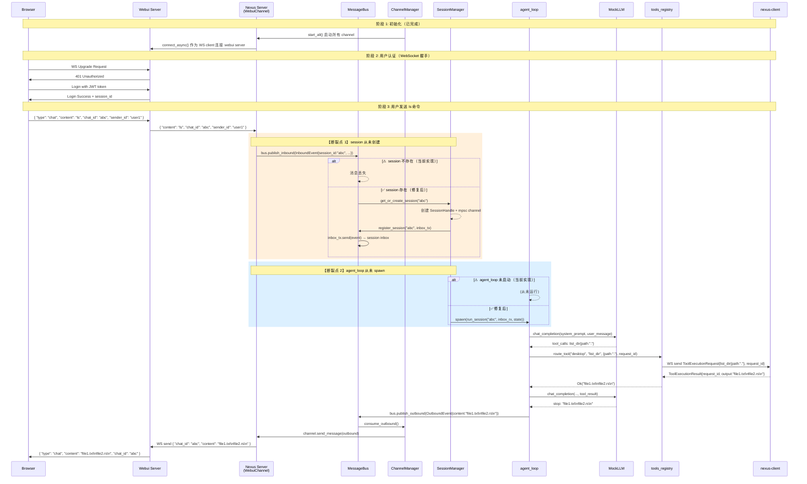

# NEXUS E2E 消息流设计文档

> 本文档描述用户通过浏览器要求 Agent 执行 `ls` 命令的完整数据流。
> 基于当前 worktree 实现状态，标注哪些已实现、哪些是设计意图。

---

## 系统组件关系

```
┌──────────────────────────────────────────────────────────────────────────────┐
│                              BROWSER                                         │
│                         WebSocket 连接                                        │
└──────────────────────────────────────────────────────────────────────────────┘
                                    │
                                    │ WS (text/json)
                                    ▼
┌──────────────────────────────────────────────────────────────────────────────┐
│                          WEBUI SERVER                                        │
│  - 独立的 Node.js/其他 WS 服务器（尚未实现）                                    │
│  - 浏览器 WS 入口                                                            │
│  - 将消息转发给 NEXUS Server（作为 WS client）                                │
│                                                                              │
│  收到 Browser 消息格式:                                                       │
│    { "type": "chat", "content": "ls", "chat_id": "xxx", "sender_id": "yyy" } │
│                                                                              │
│  转发给 NEXUS 格式:                                                          │
│    { "content": "ls", "chat_id": "xxx", "sender_id": "yyy" }                │
│                                                                              │
│  从 NEXUS 收到格式:                                                          │
│    { "chat_id": "xxx", "content": "AI 的回复", "media": [], "metadata": {} } │
│                                                                              │
│  转发给 Browser 格式:                                                         │
│    { "type": "chat", "content": "AI 的回复", "chat_id": "xxx" }             │
└──────────────────────────────────────────────────────────────────────────────┘
                                    │
                                    │ WS Client (outbound)
                                    │ WS Server (inbound)
                                    ▼
┌──────────────────────────────────────────────────────────────────────────────┐
│                          NEXUS SERVER                                        │
│                                                                              │
│  ┌─────────────────────────────────────────────────────────────────────┐    │
│  │                     WebuiChannel (WS Client)                         │    │
│  │  - start() 连接到 webui server WS                                   │    │
│  │  - Read Task: WS Message → JSON → InboundEvent → bus.publish_inbound │    │
│  │  - Write Task: bus.consume_outbound → OutboundEvent → WS → webui    │    │
│  │  - send_message(): 序列化 OutboundEvent → WS 发送                   │    │
│  └─────────────────────────────────────────────────────────────────────┘    │
│                                    │                                         │
│                                    ▼                                         │
│  ┌─────────────────────────────────────────────────────────────────────┐    │
│  │                        MessageBus                                     │    │
│  │                                                                      │    │
│  │  inbound_routes: DashMap<session_id, mpsc::Sender<InboundEvent>>     │    │
│  │                    ↑ 路由表，每 session 一个 inbox                    │    │
│  │                                                                      │    │
│  │  outbound_tx/rx: mpsc::Sender<OutboundEvent>                         │    │
│  │                    ↑ 全局队列，ChannelManager 单消费者                │    │
│  │                                                                      │    │
│  │  publish_inbound(event):                                             │    │
│  │    从 inbound_routes 找到 session_id 对应的 tx                       │    │
│  │    tx.send(event).await → 发送到 session inbox                      │    │
│  │    ⚠ 如果 session 不存在，消息丢弃（当前实现断裂点）                   │    │
│  │                                                                      │    │
│  │  publish_outbound(event):                                            │    │
│  │    outbound_tx.send(event).await → 全局队列                          │    │
│  └─────────────────────────────────────────────────────────────────────┘    │
│                                    │                                         │
│                                    ▼                                         │
│  ┌─────────────────────────────────────────────────────────────────────┐    │
│  │                    ChannelManager                                     │    │
│  │                                                                      │    │
│  │  start():                                                           │    │
│  │    1. 调用所有 channel.start() 启动各 channel                         │    │
│  │    2. 启动 dispatch loop (consume_outbound → channel.send_message)   │    │
│  │                                                                      │    │
│  │  ⚠ 缺少: inbound dispatcher（将消息路由到 session inbox）            │    │
│  └─────────────────────────────────────────────────────────────────────┘    │
│                                    │                                         │
│                                    ▼                                         │
│  ┌─────────────────────────────────────────────────────────────────────┐    │
│  │                     SessionManager                                   │    │
│  │                                                                      │    │
│  │  sessions: HashMap<session_id, SessionHandle>                       │    │
│  │                                                                      │    │
│  │  get_or_create_session(session_id):                                 │    │
│  │    返回 (created: bool, Option<(inbox_tx, inbox_rx)>)               │    │
│  │    - 新 session: 创建 mpsc channel，返回 tx/rx                      │    │
│  │    - 已存在: 返回 (false, None)                                      │    │
│  │                                                                      │    │
│  │  ⚠ 函数已实现，但从未被调用                                          │    │
│  └─────────────────────────────────────────────────────────────────────┘    │
│                                    │                                         │
│                                    ▼                                         │
│  ┌─────────────────────────────────────────────────────────────────────┐    │
│  │                     agent_loop::run_session                          │    │
│  │                                                                      │    │
│  │  - 消费 session inbox (mpsc::Receiver<InboundEvent>)                │    │
│  │  - 调用 run_single_turn() → MockLLM                                 │    │
│  │  - 结果通过 bus.publish_outbound() 发送                             │    │
│  │                                                                      │    │
│  │  ⚠ 函数已实现，但从未被 spawn                                        │    │
│  └─────────────────────────────────────────────────────────────────────┘    │
│                                    │                                         │
│                                    ▼                                         │
│  ┌─────────────────────────────────────────────────────────────────────┐    │
│  │                       MockLLM (providers/mock.rs)                     │    │
│  │                                                                      │    │
│  │  两轮状态机:                                                         │    │
│  │    Turn 1: user message → tool_calls: list_dir{path:"."}           │    │
│  │    Turn 2: tool result → stop: "Files: ..."                         │    │
│  │                                                                      │    │
│  │  ✅ 已实现并通过测试                                                  │    │
│  └─────────────────────────────────────────────────────────────────────┘    │
│                                                                              │
│  ┌─────────────────────────────────────────────────────────────────────┐    │
│  │                    tools_registry::route_tool                         │    │
│  │                                                                      │    │
│  │  - 查找 device_name 对应的 DeviceState (ws_tx)                      │    │
│  │  - 通过 ws_tx 发送 ToolExecutionRequest 到 nexus-client              │    │
│  │  - 通过 oneshot 等待 ToolExecutionResult                             │    │
│  │                                                                      │    │
│  │  DeviceState 来自 ws.rs 的设备注册 (nexus-client 连接时)              │    │
│  └─────────────────────────────────────────────────────────────────────┘    │
│                                                                              │
└──────────────────────────────────────────────────────────────────────────────┘

                                    │
                                    │ WS (ToolExecutionRequest)
                                    ▼
┌──────────────────────────────────────────────────────────────────────────────┐
│                           NEXUS CLIENT                                       │
│  - nexus-client 通过 ws.rs 注册到 server                                   │
│  - 收到 ToolExecutionRequest，执行工具                                    │
│  - 通过 WS 发送 ToolExecutionResult 回 server                              │
└──────────────────────────────────────────────────────────────────────────────┘
```

---

## 完整消息序列



---

## 各阶段详细说明

### 阶段 1: 初始化（main.rs）

```
main.rs:
  1. 创建 PgPool 连接数据库
  2. db::init_db() 初始化表
  3. 创建 MessageBus (Arc)
  4. 创建 ChannelManager
  5. 注册 WebuiChannel + MockChannel
  6. 调用 channel_manager.start_all().await
     → 启动 WebuiChannel: connect_async() 到 webui server
     → 启动 dispatch loop: consume_outbound() → channel.send_message()
  7. 调用 channel_manager.start()
     → ⚠ 只启动 dispatch loop，不启动 inbound dispatcher
```

### 阶段 2: WebSocket 握手（webui server）

```
Browser → webui server:
  1. WS Upgrade Request（携带 JWT）
  2. webui server 验证 JWT
  3. 返回登录成功 + session_id

⚠ webui server 尚未实现
```

### 阶段 3: 消息收发（核心流程）

#### 3.1 消息入口 — WebuiChannel Read Task

```rust
// channels/webui.rs 第 74-128 行
tokio::spawn(async move {
    while let Some(msg) = read.next().await {
        // 解析 JSON
        let inbound = InboundEvent {
            channel: "webui".to_string(),
            sender_id,       // 来自 JSON
            chat_id,         // 来自 JSON
            content,         // 来自 JSON
            session_id: chat_id,  // chat_id 作为 session_id
            timestamp: None,
            media: vec![],
            metadata: Default::default(),
        };
        bus_clone.publish_inbound(inbound).await;
    }
});
```

**问题**: `publish_inbound` 路由到空的 `inbound_routes`，消息丢失。

#### 3.2 消息路由 — MessageBus.publish_inbound

```rust
// bus.rs 第 69-76 行
pub async fn publish_inbound(&self, event: InboundEvent) {
    let session_id = event.session_id.clone();
    if let Some(tx) = self.inbound_routes.get(&session_id) {
        // ✅ session 存在：路由到 inbox
        let _: Result<(), _> = tx.send(event).await;
    }
    // ❌ session 不存在：静默丢弃
}
```

**问题**: `inbound_routes` 永远为空（从未调用 `register_session`）。

#### 3.3 Session 创建 — SessionManager.get_or_create_session

```rust
// session.rs 第 28-43 行
pub async fn get_or_create_session(&self, session_id: &str) ->
    (bool, Option<(mpsc::Sender<InboundEvent>, mpsc::Receiver<InboundEvent>)>) {

    if sessions.contains_key(session_id) {
        return (false, None);  // 已存在
    }

    // 创建新 session
    let (inbox_tx, inbox_rx) = mpsc::channel(64);
    let handle = SessionHandle { lock: Arc::new(RwLock::new(())) };
    sessions.insert(session_id.to_string(), handle);

    (true, Some((inbox_tx, inbox_rx)))  // 返回 tx 供注册，rx 供 agent_loop
}
```

**问题**: 函数已实现但从未被调用。

#### 3.4 Agent Loop 消费

```rust
// agent_loop.rs 第 27-54 行
pub async fn run_session(
    session_id: String,
    mut inbox: mpsc::Receiver<InboundEvent>,
    state: Arc<AppState>,
) {
    info!("agent_session started: session_id={}", session_id);

    while let Some(event) = inbox.recv().await {
        info!("agent_session {} received: content={}", session_id, event.content);

        let lock = state.session_manager.get_session_lock(&session_id).await
            .expect("session lock must exist");
        let _guard = lock.read().await;

        match run_single_turn(&state, &event).await {
            Ok(response) => {
                state.bus.publish_outbound(make_outbound(&event, response)).await;
            }
            Err(e) => {
                state.bus.publish_outbound(make_outbound(&event, format!("Error: {}", e))).await;
            }
        }
    }
}
```

**问题**: 函数已实现但从未被 spawn。

---

## 数据结构定义

### InboundEvent（bus.rs）

```rust
pub struct InboundEvent {
    pub channel: String,           // "webui" | "discord" | "telegram"
    pub sender_id: String,         // 用户 ID
    pub chat_id: String,           // 会话 ID
    pub content: String,           // 消息内容 "ls"
    pub session_id: String,         // Nexus 内部 session 标识（通常 = chat_id）
    pub timestamp: Option<DateTime<Utc>>,
    pub media: Vec<String>,        // 媒体 URL 列表
    pub metadata: HashMap<String, serde_json::Value>,
}
```

### OutboundEvent（bus.rs）

```rust
pub struct OutboundEvent {
    pub channel: String,           // 目标 channel
    pub chat_id: String,           // 会话 ID
    pub content: String,           // AI 回复内容
    pub media: Vec<String>,
    pub metadata: HashMap<String, serde_json::Value>,
}
```

### DeviceState（state.rs）

```rust
pub struct DeviceState {
    pub user_id: String,
    pub device_name: String,
    pub ws_tx: mpsc::Sender<Message>,   // WS 发送通道（发给 nexus-client）
    pub tools: Vec<serde_json::Value>,  // 工具 schema
    pub last_seen: Instant,
}
```

---

## 断裂点总结

| # | 位置 | 问题 | 状态 |
|---|------|------|------|
| 1 | `ChannelManager::start()` | 只有 dispatch loop（outbound），无 inbound dispatcher | ⚠ 未实现 |
| 2 | `MessageBus::publish_inbound` | `inbound_routes` 永远为空，消息丢弃 | ⚠ 未实现 |
| 3 | `SessionManager::get_or_create_session` | 已实现但从未调用 | ⚠ 未实现 |
| 4 | `agent_loop::run_session` | 已实现但从未 spawn | ⚠ 未实现 |
| 5 | `db::create_session` | 只有 TODO 注释，无实现 | ❌ 未实现 |
| 6 | `db::save_message` | 只有 TODO 注释，无实现 | ❌ 未实现 |
| 7 | `db::get_session_history` | 只有 TODO 注释，无实现 | ❌ 未实现 |
| 8 | webui server | 独立的 WS 服务器不存在 | ❌ 未实现 |

---

## ws.rs 与 channels 的职责划分

```
ws.rs（nexus-client 连接）:
  - 接收 SubmitToken → 验证设备 token
  - 接收 Heartbeat → 更新 last_seen
  - 接收 RegisterTools → 存储设备工具 schema
  - 接收 ToolExecutionResult → 通过 oneshot 唤醒 route_tool

channels/（用户消息入口）:
  - WebuiChannel → 接收 webui server 转发来的用户消息
  - MockChannel → 测试用消息注入
  - 用户消息 → MessageBus → session inbox → agent_loop
```

**两者完全独立**，ws.rs 处理的是 nexus-client（工具执行器），channels 处理的是用户消息入口。

---

## MockLLM 测试验证（providers/mock.rs）

当前 MockLLM 已实现两轮状态机，用于验证完整 ReAct 循环：

```rust
// Turn 1: user → tool_calls
// Turn 2: tool_result → stop

// ✅ 测试已通过
// 问题：agent_loop 从未被调用，无法端到端验证
```
