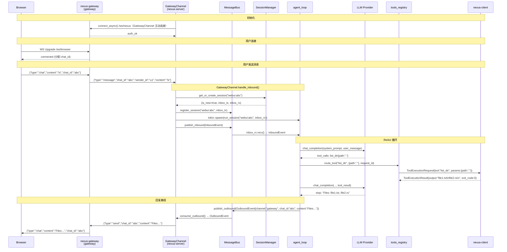

# NEXUS E2E 消息流文档

> 描述用户通过浏览器要求 Agent 执行 `ls` 命令的完整数据流。
> 最后更新：2026-03-30（所有链路已打通）

---

## 系统拓扑

```
Browser ──WS /ws/browser──► nexus-gateway (Rust gateway)
                                    │
                            WS /ws/nexus (GatewayChannel 主动连接)
                                    │
                             nexus-server
                            ┌───────┴────────┐
                         channels/        ws.rs
                       (用户消息入口)   (设备连接入口)
                            │                │
                        MessageBus       DeviceState
                            │                │
                       SessionManager   tools_registry
                            │                │
                        agent_loop ──────────┘
                            │
                           LLM
                                    │
                            WS (ToolExecutionRequest)
                                    │
                             nexus-client
                          (执行工具，返回结果)
```

---

## 完整消息序列



---

## 组件职责边界

### ws.rs vs channels/

```
ws.rs（nexus-client 设备连接）:
  - 接收 SubmitToken → 验证 Device Token
  - 接收 Heartbeat → 更新 last_seen
  - 接收 RegisterTools → 存储工具 schema 到 AppState
  - 接收 ToolExecutionResult → 通过 oneshot 唤醒 route_tool

channels/（用户消息入口）:
  - GatewayChannel → 连接 nexus-gateway，收消息创建 session，发回复
  - DiscordChannel → 连接 Discord Gateway（规划中）
  - 消息路径：用户消息 → MessageBus → session inbox → agent_loop
```

两者**完全独立**。ws.rs 处理工具执行器（nexus-client），channels 处理用户消息来源。

---

## 数据结构

### InboundEvent（bus.rs）

```rust
pub struct InboundEvent {
    pub channel: String,       // "gateway" | "discord" | "telegram"
    pub sender_id: String,
    pub chat_id: String,
    pub content: String,
    pub session_id: String,    // "gateway:{chat_id}"
    pub timestamp: Option<DateTime<Utc>>,
    pub media: Vec<String>,
    pub metadata: HashMap<String, serde_json::Value>,
}
```

### OutboundEvent（bus.rs）

```rust
pub struct OutboundEvent {
    pub channel: String,
    pub chat_id: String,
    pub content: String,
    pub media: Vec<String>,
    pub metadata: HashMap<String, serde_json::Value>,
}
```

### DeviceState（state.rs）

```rust
pub struct DeviceState {
    pub user_id: String,
    pub device_name: String,
    pub ws_tx: mpsc::Sender<Message>,
    pub tools: Vec<serde_json::Value>,
    pub last_seen: Instant,
}
```

---

## Session ID 命名约定

| Channel | session_id 格式 |
|---------|----------------|
| webui | `gateway:{chat_id}` |
| discord | `discord:{channel_id}` （规划） |
| telegram | `telegram:{chat_id}` （规划） |

格式由各 Channel 的 `handle_inbound` 负责生成（参见 `channels/gateway.rs::make_session_id`）。

---

## 待完成（M3 剩余）

| 项目 | 位置 | 说明 |
|------|------|------|
| 真实 LLM Provider | `providers/openai.rs` | 目前使用 MockLLM |
| 会话历史拼装 | `context.rs` | 多轮对话消息拼入 LLM 请求 |
| DB 持久化 | `db.rs` | create_session / save_message / get_history |
| 多设备路由 | `tools_registry.rs` | device_name schema 注入，见 DEVICE-ROUTING.md |
